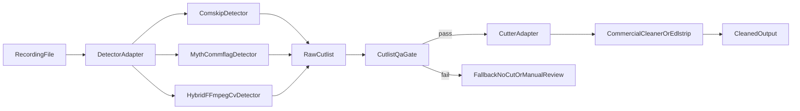

# Commercial Removal Upgrade Options

## What The Deep Dive Confirmed
- Current pipeline is detector+cleaner chaining in [`gui/postprocess.py`](gui/postprocess.py):
  - `comskip.exe [--ini=...] <recording>` generates `.edl`
  - `CommercialCleaner.exe -ffmpegPath=... -inFile=...` performs cuts.
- Existing detector profile in [`tools/comskip/comskip.ini`](tools/comskip/comskip.ini) uses `detect_method=43` (black/logo/fuzzy/aspect), with silence and scene-change methods not enabled.
- The app validates only process exit and output existence, not EDL quality/plausibility (no guardrails for bad cutlists).
- Your own cleaner log (`CommercialCleaner.log`) shows long processing and codec decisions (`libx264`/`aac`), confirming cutter behavior is largely opaque and can amplify detector mistakes.

## Root Cause Hypothesis
- Ad-removal quality is limited less by orchestration code and more by detector strategy mismatch (current Comskip heuristics vs IPTV content characteristics) and unvalidated EDL handoff to a black-box cutter.

## Candidate Projects To Implement (CPU-only, local)

### Option 1 (Lowest Risk): Keep Comskip, Replace Method Around It
- Build a **Comskip profile manager** with channel-specific `.ini` presets and confidence gates before cutting.
- Add an **EDL QA pass** in your pipeline (reject suspicious cutlists: too many cuts, impossible durations, no-show runtime left).
- Replace or A/B test cutter with:
  - [`edlstrip`](https://github.com/shuaiscott/edlstrip) (simple EDL-based ffmpeg stripping)
  - [`comcut`/`comchap`](https://github.com/BrettSheleski/comchap) wrappers (more transparent workflow around Comskip).
- Why this is promising: minimal architecture change and fastest path to measurable quality gains.

### Option 2 (Best True Detector Alternative): Integrate MythTV `mythcommflag`
- Use `mythcommflag --skipdb --file ... --outputfile ... --method ...` as detector instead of Comskip.
- `mythcommflag` supports multiple detector families (`blank`, `scene`, `logo`, `all`, `d2_*`) and richer per-frame outputs.
- Requires adapter work:
  - parse `COMM_START/COMM_END` frame markers,
  - convert to time-based EDL (or direct ffmpeg segment plan),
  - handle fps/timebase conversion robustly.
- Main risk: packaging/build complexity on Windows and operational footprint.

### Option 3 (Highest Control, Medium/High Effort): Build A Hybrid Detector Project In-Repo
- Create a new local detector service/script combining:
  - FFmpeg `blackdetect` metadata (`lavfi.black_start/end`),
  - FFmpeg `silencedetect` metadata (`lavfi.silence_*`),
  - optional logo-presence check (OpenCV ROI template matching),
  - optional OCR cue detection for bumper text.
- Fuse signals with weighted scoring and hard constraints, then generate EDL.
- Benefits: transparent logic, channel-specific tuning, and no dependence on opaque external cleaner behavior.
- Risks: more engineering and dataset/tuning effort.

### Option 4 (Niche/Channel-Specific Add-on): Caption/Marker-Driven Detector
- For sources exposing deterministic subtitle markers (e.g., Discovery+ style timestamp-map patterns), add a dedicated marker parser detector.
- Extremely high precision for supported channels, but narrow applicability.

## Recommended Execution Order
1. **Immediate win path:** Option 1 (profile manager + EDL QA + cutter A/B).
2. **Parallel spike:** Option 2 feasibility (mythcommflag packaging + conversion adapter).
3. **If quality still insufficient:** Option 3 hybrid detector as first-party project.
4. **Add Option 4 only where source-specific markers are available.**

## Proposed Target Architecture

## File-Focused Implementation Plan (for next execution phase)
- Extend post-process orchestration in [`gui/postprocess.py`](gui/postprocess.py) to support detector and cutter adapters instead of fixed Comskip+CommercialCleaner.
- Add detector/cutter settings to job/config model in [`gui/config_store.py`](gui/config_store.py) and related UI control in [`gui/main.py`](gui/main.py).
- Add EDL sanity checks before cutting in a new module (e.g., `gui/edl_validation.py`) and wire into `run_postprocessing`.
- Preserve current fallback paths from [`gui/paths.py`](gui/paths.py) while adding new optional tool resolvers.

## Success Criteria
- False-cut rate reduced (fewer show segments removed).
- Missed-commercial rate reduced (fewer ad segments retained).
- Runtime remains acceptable on CPU-only systems.
- Toolchain remains fully local/offline and scriptable from current job runner.
